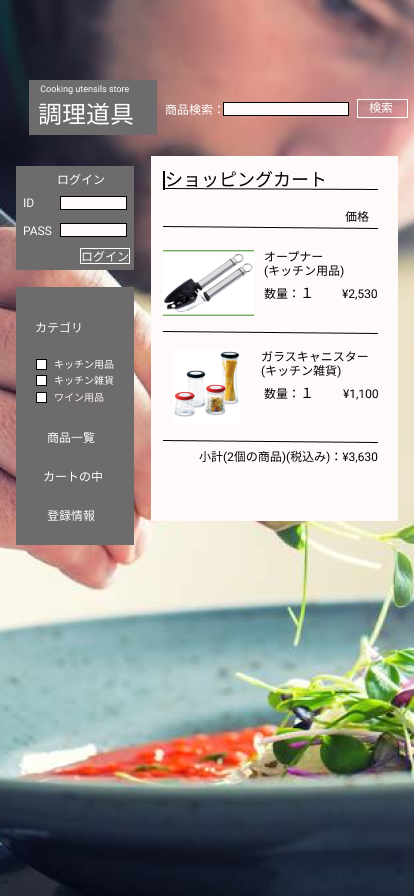

### 画面詳細図
## カートの中(キッチン用品・キッチン雑貨・ワイン用品)
### プロトタイプは以下のリンク先
[プロトタイプ](https://www.figma.com/file/Bbyoi3oY44HApNDN9uLFlB/cook?node-id=1%3A3)
*****

*****
補足：対応DBの列はDB設計後、○を対応するテーブル・カラム名に差し替えること。

| ID | 要素 | 内容 | アクション | イベント | 対応DB |
|----|------|-----|------------|---------|-------|
|1   |バナー   |サイト名表示|クリック|キッチン用品画面へ遷移|-      |
|2   |ログイン  |テキスト画像|-    |-        |-      |
|3   |ID       |入力欄　　|-    |-        |-      |
|4   |PASS     |入力欄　　|-    |-        |-      |
|5   |ログインボタン|ボタン|クリック|キッチン用品画面へ遷移|-      |
|6   |商品検索  |テキスト表示|-    |-        |-      |
|7   |商品名　  |入力欄　　|-      |-        |-      |
|8   |検索　　  |ボタン　　　|クリック|その商品の詳細画面へ遷移|-      |
|9   |価格      |テキスト表示|-    |-        |-      |
|10  |値段　    |テキスト表示　　|-    |-        |-      |
|11  |カテゴリ  |テキスト表示|-    |-        |-      |
|12  |キッチン用品　|テキスト表示|-    |-        |-      |
|13  |キッチン用品　|ボタン|クリック|キッチン用品画面へ遷移|-      |
|14  |キッチン雑貨　|テキスト表示|-    |-        |-      |
|15  |キッチン雑貨　|ボタン|クリック|キッチン雑貨画面へ遷移|-      |
|16  |ワイン用品|テキスト表示|-    |-        |-      |
|17  |ワイン用品|ボタン|クリック|ワイン用品画面へ遷移|-      |
|18  |商品一覧|画像ボタン　　　|クリック|キッチン用品画面へ遷移|-      |
|19  |カートの中|画像ボタン |クリック|カートの中の画面へ遷移|-      |
|20  |登録情報|画像ボタン　 |クリック|会員情報画面へ遷移|-      |
|21  |商品画像    |画像表示 |-      |-               |-      |
|23  |ショッピングカート|テキスト表示  |-      |-        |-               |
|24  |ID      |テキスト画像　|-      |-        |-               |
|25  |商品名  |テキスト表示 |-       |-        |-               |
|26  |PASS    |テキスト画像　|-    |-        |-                   |
|28  |数量     |テキスト画像　|-    |-        |-                  |
|29  |個数     |購入個数|リスト|drop-downから個数選択|-             |
|30  |小計     |小計の金額表示|-   |-      |-         |
