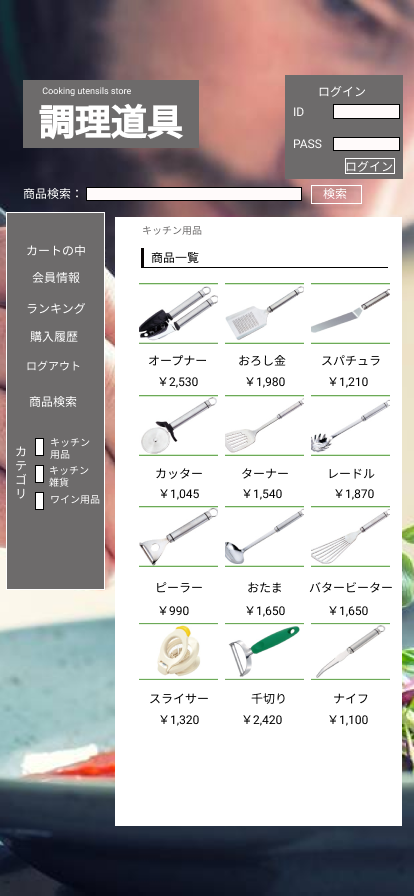
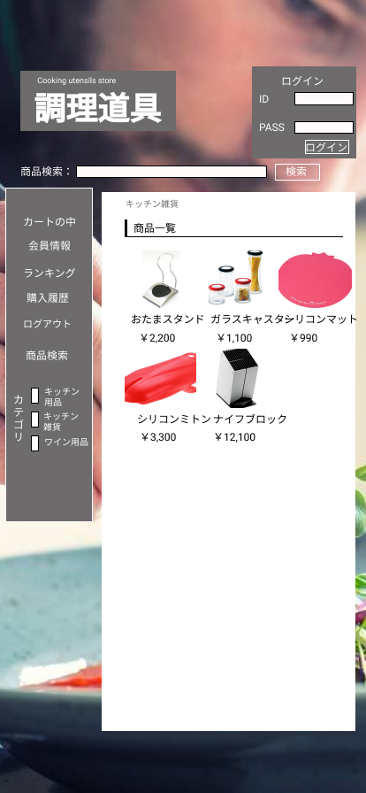
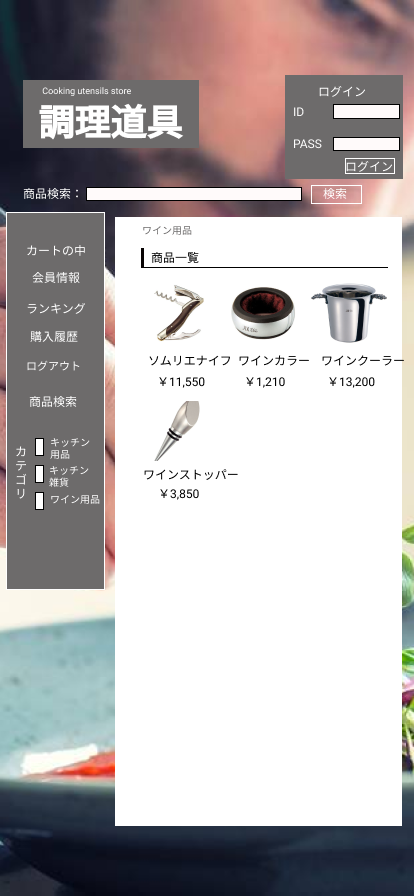

### 画面詳細図
## トップページ(キッチン用品・キッチン雑貨・ワイン用品)
### プロトタイプは以下のリンク先
[プロトタイプ](https://www.figma.com/file/Bbyoi3oY44HApNDN9uLFlB/cook?node-id=1%3A3)
*****

*****
補足：対応DBの列はDB設計後、○を対応するテーブル・カラム名に差し替えること。

| ID | 要素 | 内容 | アクション | イベント | 対応DB |
|----|------|-----|------------|---------|-------|
|1   |バナー|サイト名表示|-      |-        |-      |
|2   |ログイン|テキスト画像|-    |-        |-      |
|3   |ID     |入力欄　　|-    |-        |-      |
|4   |PASS   |入力欄　　|-    |-        |-      |
|5   |ログインボタン|ボタン|-    |-        |-      |
|6   |商品検索|テキスト画像|-    |-        |-      |
|7   |商品名　|入力欄　　|-    |-        |-      |
|8   |検索　　|ボタン　　　|-    |-        |-      |
|9   |商品検索|テキスト画像|-    |-        |-      |
|10  |値段　|テキスト表示　　|-    |-        |-      |
|11  |カテゴリ|テキスト表示|-    |-        |-      |
|12  |キッチン用品　|テキスト表示|-    |-        |-      |
|13  |キッチン用品　|ボタン|-    |-        |-      |
|14  |キッチン雑貨　|テキスト表示|-    |-        |-      |
|15  |キッチン雑貨　|ボタン|-    |-        |-      |
|16  |ワイン用品　|テキスト表示|-    |-        |-      |
|17  |ワイン用品　|ボタン|-    |-        |-      |
|18  |ランキング　　|ボタン　　　|-    |-        |-      |
|19  |カートの中|画像ボタン|-    |-        |-      |
|20  |会員情報|画像ボタン　|-    |-        |-      |
|21  |購入履歴|画像ボタン　|-    |-        |-      |
|22  |ログアウト|画像ボタン　|-    |-        |-      |
|23  |商品一覧|テキスト表示|-    |-        |-      |
|24  |商品画像|画像リンク　|-    |-        |-      |
|25  |商品名|テキストリンク|-    |-        |-      |
|26  |商品画像|画像表示　　|-    |-        |-      |
|27  |商品名|テキスト表示　　|-    |-        |-      |
|28  |ID|テキスト画像　　|-    |-        |-      |
|29  |PASS|テキスト画像　　|-    |-        |-      |
