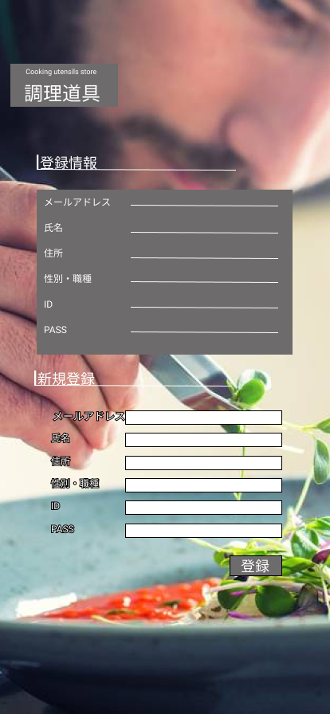

### 画面詳細図
## 会員情報
### プロトタイプは以下のリンク先
[プロトタイプ](https://www.figma.com/file/Bbyoi3oY44HApNDN9uLFlB/cook?node-id=1%3A3)
*****

*****
補足：対応DBの列はDB設計後、○を対応するテーブル・カラム名に差し替えること。

| ID | 要素 | 内容 | アクション | イベント | 対応DB |
|----|------|-----|------------|---------|-------|
|1   |バナー   |サイト名表示|クリック|キッチン用品画面へ遷移|-      |
|2   |登録情報  |テキスト画像|-    |-        |-      |
|3   |新規登録  |テキスト画像　　  |-        |-        |-      |
|4   |ID       |テキスト画像　　  |-        |-        |-      |
|5   |PASS     |テキスト画像|-   |-        |-      |
|6   |ID       |入力欄     |-    |-        |-      |
|7   |PASS 　  |入力欄　　  |-    |-        |-      |
|8   |登録　　  |ボタン　　　|クリック|キッチン用品画面へ遷移|-   |
|9   |メールアドレス  |テキスト画像|-|-        |-      |
|10  |氏名  |テキスト画像        |- |-        |-      |
|11  |住所  |テキスト画像        |- |-        |-      |
|12  |性別・職種  |テキスト画像  |-  |-        |-      |
|13  |性別・職種  |入力欄       |-   |-        |-      |
|14  |住所  |入力欄             |-  |-         |-      |
|15  |メールアドレス|入力欄     |-   |-        |-      |
|16  |氏名       |入力欄        |-  |-        |-      |
|17  |住所      |入力欄        |-   |-        |-      |
