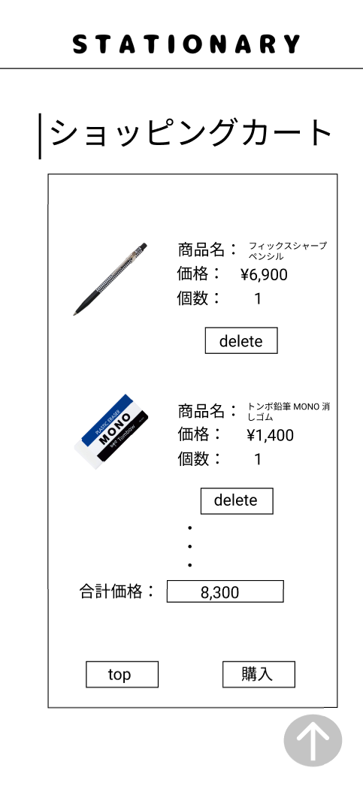

### 画面詳細図
## カート
### プロトタイプは以下のリンク先
[プロトタイプ](https://www.figma.com/file/YN8g4ahM3raStzCZMDXhNA/stationary?node-id=1%3A10)
*****

*****
補足：対応DBの列はDB設計後、○を対応するテーブル・カラム名に差し替えること。

| ID | 要素 | 内容 | アクション | イベント | 対応DB |
|----|------|-----|------------|---------|-------|
|1   |バナー　　　　　　|テキスト画像ボタン|クリック|シャーペン(ジャンル)へ遷移|-|
|2   |ショッピングカート|テキスト　　　　　|-    　|-        　　　　　　　　|-|
|3   |商品画像　　　　　|画像　　　　　　　|-    　|-        　　　　　　　　|-|
|4   |商品名　　　　　　|テキスト　　　　　|-    　|-        　　　　　　　　|-|
|5   |商品名テキスト　　|テキスト　　　　　|-    　|-      　　　　　　　　　|○|
|6   |価格　　　　　　　|テキスト　　　　　|-    　|-      　　　　　　　　　|-|
|7   |価格テキスト　　　|テキスト　　　　　|-    　|-      　　　　　　　　　|○|
|8   |合計価格　　　　　|テキスト　　　　　|-    　|-      　　　　　　　　　|-|
|9   |合計価格テキスト　|テキスト　　　　　|-    　|-      　　　　　　　　　|-|
|10  |個数　　　　　    |テキスト　　　　　|-    　|-      　　　　　　　　　|-|
|11  |個数テキスト　    |テキスト　　　　　|-    　|-      　　　　　　　　　|○|
|12  |購入ボタン　　　　|ボタン　　　　　　|クリック|購入完了へ遷移　　　　　　|○|

