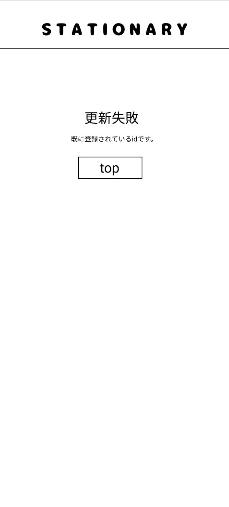

### 画面詳細図
## 更新失敗
### プロトタイプは以下のリンク先
[プロトタイプ](https://www.figma.com/file/YN8g4ahM3raStzCZMDXhNA/stationary?node-id=1%3A2)
*****

*****
補足：対応DBの列はDB設計後、○を対応するテーブル・カラム名に差し替えること。

| ID | 要素 | 内容 | アクション | イベント | 対応DB |
|----|------|-----|------------|---------|-------|
|1   |バナー　　　　|テキスト画像|-      |-        　　 |-|
|2   |更新失敗     |テキスト　　|-      |-        　　　|-|
|3   |失敗コメント |テキスト　　|-      |-        　　　|-|
|4   |topボタン    |ボタン　　　|クリック|シャーペン(ジャンル)へ遷移|- |

