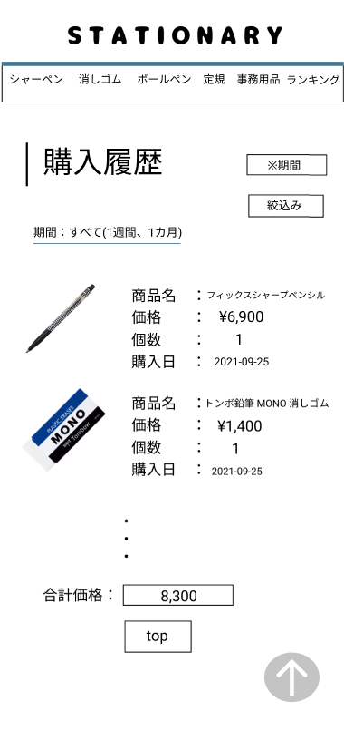

### 画面詳細図
## 履歴
### プロトタイプは以下のリンク先
[プロトタイプ](https://www.figma.com/file/YN8g4ahM3raStzCZMDXhNA/stationary?node-id=1%3A2)
*****

*****
補足：対応DBの列はDB設計後、○を対応するテーブル・カラム名に差し替えること。

| ID | 要素 | 内容 | アクション | イベント | 対応DB |
|----|------|-----|------------|---------|-------|
|1   |バナー　　　　　　       |テキスト画像ボタン|クリック|シャーペン(ジャンル)へ遷移|-|
|2   |シャーペンテキストボタン　|ボタン　　　　　　|クリック|-        　　　　　　　　|-|
|3   |消しゴムテキストボタン   |ボタン　　　　　　|クリック|-        　　　　　　　　|-|
|4   |ボールペンテキストボタン |ボタン　　　　　　|クリック|-        　　　　　　　　|-|
|5   |定規テキストボタン       |ボタン　　　　　　|クリック|-        　　　　　　　　|-|
|6   |事務用品テキストボタン   |ボタン　　　　　　|クリック|-        　　　　　　　　|-|
|7   |履歴　　　　　　　       |テキスト　　　　　|-    　|-        　　　　　　　　|-|
|8   |期間欄テキスト　　       |テキスト ※セレクトボックスで表示|-|-            |-|
|8   |絞込みボタン       　　　|ボタン　　　　　　|クリック|絞り込まれた履歴ページへ遷移|-|
|8   |期間テキスト　　       　|テキスト 始めはすべての期間が表示 機関が絞られたらその絞られた期間が表示|-|-|-|
|9   |商品画像　　　　　       |画像　　　　　　　|-    　|-        　　　　　　　　|-|
|10  |商品名　　　　　　       |テキスト　　　　　|-    　|-        　　　　　　　　|-|
|11  |商品名テキスト　　       |テキスト　　　　　|-    　|-      　　　　　　　　　|○|
|12  |価格　　　　　　　       |テキスト　　　　　|-    　|-      　　　　　　　　　|-|
|13  |価格テキスト　　　       |テキスト　　　　　|-    　|-      　　　　　　　　　|○|
|14  |合計価格　　　　　       |テキスト　　　　　|-    　|-      　　　　　　　　　|-|
|15  |合計価格テキスト　       |テキスト　　　　　|-    　|-      　　　　　　　　　|-|
|16  |個数　　　　　　　       |テキスト　　　　　|-    　|-      　　　　　　　　　|-|
|17  |個数テキスト　　　       |テキスト　　　　　|-    　|-      　　　　　　　　　|○|
|18  |購入日時　　　　　       |テキスト　　　　　|-    　|-      　　　　　　　　　|-|
|19  |日時テキスト　　　       |テキスト　　　　　|-    　|-      　　　　　　　　　|○|
|20  |トップページボタン       |ボタン　　　　　　|クリック|シャーペン(ジャンル)へ遷移|-|

