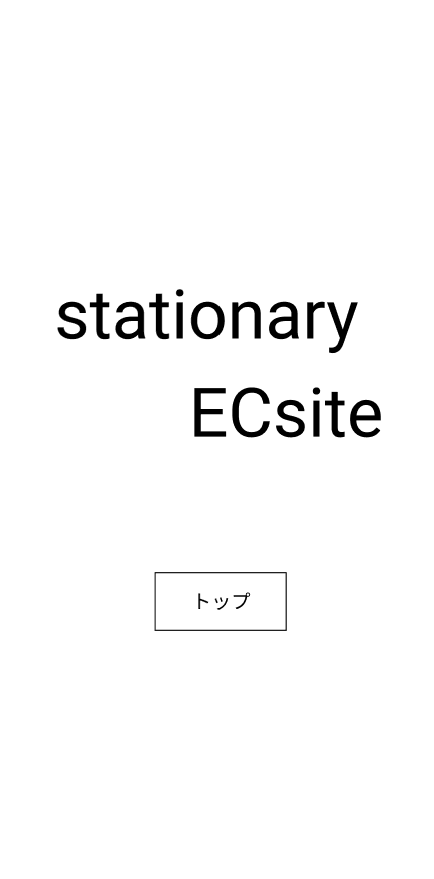

### 画面詳細図
## ホーム
### プロトタイプは以下のリンク先
[プロトタイプ](https://www.figma.com/file/YN8g4ahM3raStzCZMDXhNA/stationary?node-id=1%3A10)
*****

*****
補足：対応DBの列はDB設計後、○を対応するテーブル・カラム名に差し替えること

| ID | 要素 | 内容 | アクション | イベント | 対応DB |
|----|------|-----|------------|---------|-------|
|1   |バナー　　|テキスト　　|-      　　|-       　　　 |-|
|2   |開始ボタン|ボタン　　　|クリック|シャーペン(ジャンル)へ遷移|-|
