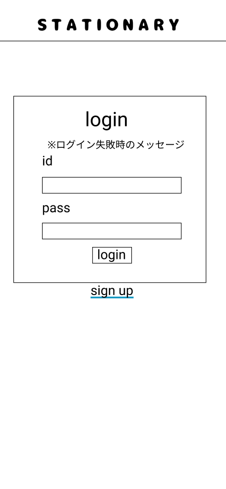

### 画面詳細図
## ログイン
### プロトタイプは以下のリンク先
[プロトタイプ](https://www.figma.com/file/YN8g4ahM3raStzCZMDXhNA/stationary?node-id=1%3A2)
*****

*****
補足：対応DBの列はDB設計後、○を対応するテーブル・カラム名に差し替えること。

| ID | 要素 | 内容 | アクション | イベント | 対応DB |
|----|------|-----|------------|---------|-------|
|1   |バナー　　　　|テキスト画像|-           |-        　         |-|
|2   |ログイン　　　|テキスト　　|-    　　　 |-                   |-|
|3   |ログイン失敗時のメッセージ|テキスト ※ログイン失敗時のみしか表示されない|-||-|
|4   |id　         |テキスト　　|-    　　　|-                    |-|
|5   |idテキスト　　|入力欄 ※アルファベット/数字で入力|テキスト入力|-        　　　　　　 |○|
|6   |pass　　　　　|テキスト　　|-   　　　 |-        　　　　　　|-|
|7   |passテキスト　|入力欄 ※数字で入力|テキスト入力|-        　　　　　　|○|
|8   |ログインボタン|ボタン　　　|クリック    |ログイン完了へ遷移 ※失敗の場合は遷移しない|○|
|9   |新規登録ボタン|テキストリンク|クリック  |新規登録へ遷移　　　　　|-|

