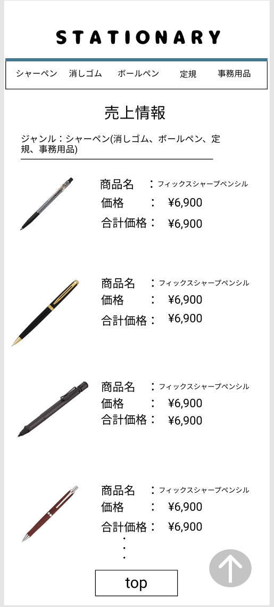

### 画面詳細図
## 売上情報
### プロトタイプは以下のリンク先
[プロトタイプ](https://www.figma.com/file/YN8g4ahM3raStzCZMDXhNA/stationary?node-id=1%3A2)
*****

*****
補足：対応DBの列はDB設計後、○を対応するテーブル・カラム名に差し替えること。

| ID | 要素 | 内容 | アクション | イベント | 対応DB |
|----|------|-----|------------|---------|-------|
|1   |バナー　　　　　　       |テキスト画像ボタン|クリック|管理画面topへ遷移|-|
|2   |シャーペンテキストボタン　|ボタン　　　　　　|クリック|シャーペンの在庫へ遷移　　|○|
|3   |消しゴムテキストボタン   |ボタン　　　　　　|クリック|消しゴムの在庫へ遷移　　　|○|
|4   |ボールペンテキストボタン |ボタン　　　　　　|クリック|ボールペンの在庫へ遷移　　|○|
|5   |定規テキストボタン       |ボタン　　　　　　|クリック|定規の在庫へ遷移　　　　　|○|
|6   |事務用品テキストボタン   |ボタン　　　　　　|クリック|事務用品の在庫へ遷移　　　|○|
|7   |売上情報　　　　　       |テキスト　　　　　|-    　|-        　　　　　　　　|-|
|8   |ジャンル名テキスト　     |テキスト　　　　　|-    　|-      　　　　　　　　　|○|
|9   |商品画像　　　　　       |画像 ※1列に並べられて、1画面に表示する|-    　|-|○|
|10  |商品名　　　　　　       |テキスト　　　　　|-    　|-        　　　　　　　　|-|
|11  |商品名テキスト　　       |テキスト　　　　　|-    　|-      　　　　　　　　　|○|
|12  |価格　　　　　　　       |テキスト　　　　　|-    　|-      　　　　　　　　　|-|
|13  |価格テキスト　　　       |テキスト ※¥マークと3桁のカンマを表示|-    　|-  |○|
|14  |合計金額　　　　　       |テキスト　　　　　|-    　|-      　　　　　　　　　|-|
|15  |合計金額テキスト　       |テキスト ※¥マークと3桁のカンマを表示|-    　|-　|-|
|16  |トップページボタン       |ボタン　　　　　　|クリック|管理画面topへ遷移|-|

