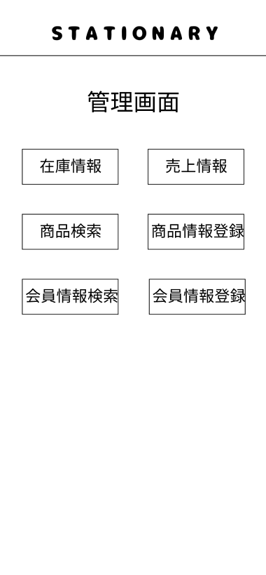

### 画面詳細図
## 管理画面top
### プロトタイプは以下のリンク先
[プロトタイプ](https://www.figma.com/file/YN8g4ahM3raStzCZMDXhNA/stationary?node-id=1%3A)
*****

*****
補足：対応DBの列はDB設計後、○を対応するテーブル・カラム名に差し替えること。

| ID | 要素 | 内容 | アクション | イベント | 対応DB |
|----|------|-----|------------|---------|-------|
|1   |バナー|テキスト画像|-      |-        |-      |
|2   |管理画面　　　　　|テキスト　　　　　|-          |-              |-|
|3   |在庫情報ボタン　　|ボタン   |クリック|在庫情報へ遷移          　　|-|
|4   |売上情報ボタン　　|ボタン   |クリック|売上情報へ遷移          　　|-|
|5   |商品検索ボタン　　|ボタン   |クリック|商品検索へ遷移          　　|-|
|6   |商品情報登録ボタン|ボタン   |クリック|商品情報登録へ遷移          |-|
|7   |会員情報検索ボタン|ボタン   |クリック|会員情報検索へ遷移          |-|
|8   |会員情報登録ボタン|ボタン   |クリック|会員情報登録へ遷移          |-|

