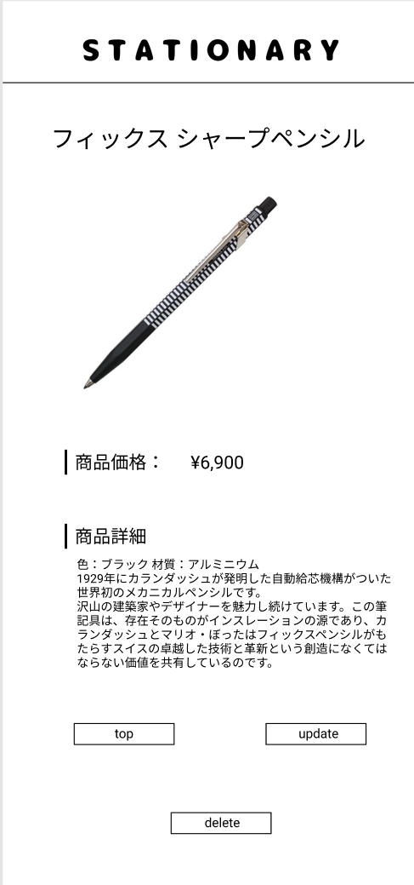

### 画面詳細図
## 商品詳細
### プロトタイプは以下のリンク先
[プロトタイプ](https://www.figma.com/file/YN8g4ahM3raStzCZMDXhNA/stationary?node-id=1%3A2)
*****

*****
補足：対応DBの列はDB設計後、○を対応するテーブル・カラム名に差し替えること

| ID | 要素 | 内容 | アクション | イベント | 対応DB |
|----|------|-----|------------|---------|-------|
|1   |バナー　　　　|テキスト画像ボタン|クリック　|管理画面topへ遷移|-|
|2   |商品名　　　　|テキスト　　　　　|-    　　|-        　　　　　　　　　|○|
|3   |商品の画像　　|商品画像　　　　　|-    　　|-       　　　　　 　　　　|○|
|4   |商品価格　　　|テキスト　　　　　|-    　　|-        　　　　　　　　　|-|
|5   |価格　　　　　|テキスト ※値段は￥マークと3桁のカンマをつける|-|-　　|○|
|6   |商品詳細　　　|テキスト　　　　　|-    　　|-        　　　　　　　　　|-|
|7   |商品詳細文章　|テキスト　　　　　|-    　　|-        　　　　　　　　　|○|
|8   |トップボタン　|ボタン　　　　　　|クリック　|管理画面topへ遷移　　　　　|-|
|9   |更新ボタン　 |ボタン　　　　　　|クリック　|商品情報更新へ遷移　　　　　|○|
|10  |削除ボタン 　|ボタン　　　　　　|クリック　|商品削除へ遷移　　　　　　　|○|
