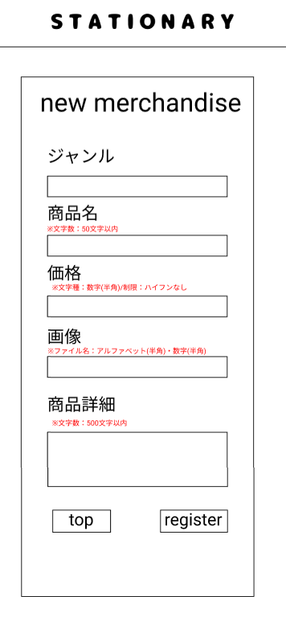

### 画面詳細図
## 商品情報登録
### プロトタイプは以下のリンク先
[プロトタイプ](https://www.figma.com/file/YN8g4ahM3raStzCZMDXhNA/stationary?node-id=1%3A2)
*****

*****
補足：対応DBの列はDB設計後、○を対応するテーブル・カラム名に差し替えること。

| ID | 要素 | 内容 | アクション | イベント | 対応DB |
|----|------|-----|------------|---------|-------|
|1   |バナー　　　　　        |テキスト画像ボタン|クリック   |管理画面topへ遷移|-|
|2   |new merchandise       |テキスト　　　　　|-    　　　|-        　　　   |-|
|3   |ジャンル　　　　       |テキスト　　　　　|-    　　　|-        　　　   |-|
|4   |ジャンルテキスト       |入力欄 ※セレクトボックスで表示|テキスト入力|- |○|
|5   |商品名　　　　　       |テキスト　　　　　|-    　　　|-        　　　   |-|
|6   |商品名テキスト　       |入力欄 文字種:全角/半角 typeをtextにする ※50文字以内 同じ商品名では登録できない|テキスト入力|-|○|
|7   |価格     　　　       |テキスト　　　　　|-    　　　|-        　　　   |-|
|8   |価格テキスト　　       |入力欄　文字種:数字 typeをnumberにする ※ハイフンなし|テキスト入力|-|○|
|9   |画像　　　      　　  |テキスト|-    　　　|-        　　　   |-|
|10  |商品画像テキスト       |入力欄　文字種:アルファベットと数字(半角) typeをfileにする|テキスト入力|-　   |○|
|11  |商品詳細     　　　　 |テキスト　　　　　|-    　　　|-        　　　   |-|
|12  |商品詳細テキスト　　　|入力欄 文字種:全角/半角 textareaにする ※500文字以内|テキスト入力|-        　　　   |○|
|13  |登録ボタン　　　      |ボタン　※制限に反した入力があれば商品登録完了へ遷移しない|クリック|商品登録完了へ遷移　　|○|
|14  |トップボタン　　　     |ボタン　　　　　　|クリック　　|管理画面topへ遷移　　|-|
|15  |制限文(商品名)　　　     　|テキスト　　　　　|-　　|-　　|-|
|16  |制限文(価格)　　　     |テキスト　　　　　|-　　|-　　|-|
|17  |制限文(商品詳細) |テキスト　　　　　|-　　|-　　|-|

