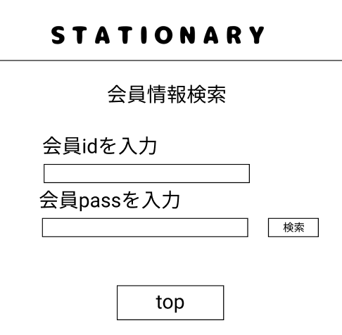

### 画面詳細図
## 会員情報検索
### プロトタイプは以下のリンク先
[プロトタイプ](https://www.figma.com/file/YN8g4ahM3raStzCZMDXhNA/stationary?node-id=1%3A10)
*****

*****
補足：対応DBの列はDB設計後、○を対応するテーブル・カラム名に差し替えること。

| ID | 要素 | 内容 | アクション | イベント | 対応DB |
|----|------|-----|------------|---------|-------|
|1   |バナー　　　　        |テキスト画像ボタン|クリック　　|管理画面topへ遷移|-|
|2   |会員情報検索　        |テキスト　　　　　|-    　　　|-        |-|
|2   |会員IDを入力　        |テキスト　　　　　|-    　　　|-        |-|
|3   |IDテキスト        　　|入力欄　　　　　|テキスト入力|-        |○|
|4   |検索ボタン　　        |ボタン　　　　　|クリック|会員情報検索結果へ遷移|○|
|5   |トップページボタン　  |ボタン　　　　　　|クリック　　|管理画面topへ遷移|-|

