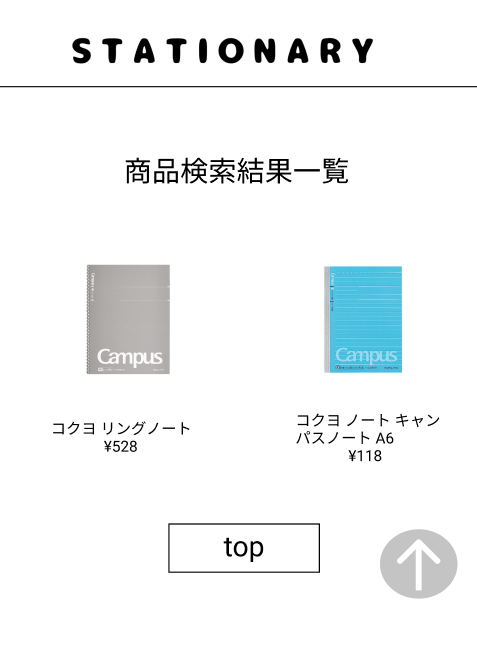

### 画面詳細図
## 商品検索結果一覧
### プロトタイプは以下のリンク先
[プロトタイプ](https://www.figma.com/file/YN8g4ahM3raStzCZMDXhNA/stationary?node-id=1%3A)
*****

*****
補足：対応DBの列はDB設計後、○を対応するテーブル・カラム名に差し替えること。

| ID | 要素 | 内容 | アクション | イベント | 対応DB |
|----|------|-----|------------|---------|-------|
|1   |バナー　　　　|テキスト画像ボタン   |クリック|管理画面topへ遷移          |-|
|8   |検索結果　　　|テキスト　　　　　|-          |-                        |-|
|9   |商品画像　　　|商品画像ボタン ※2列で並べられて、当てはまる商品を1画面に表示する|-|商品詳細へ遷移|○|
|10  |商品名/値段　|テキストボタン ※¥マークと3桁のカンマをつけて表示する 2列で並べられて、当てはまる商品を1画面に表示する|-|商品詳細へ遷移|○|
|1   |トップページボタン|ボタン   |クリック|管理画面topへ遷移          |-|

