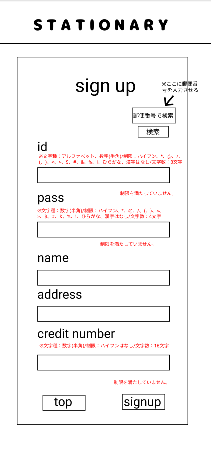

### 画面詳細図
## 会員情報登録
### プロトタイプは以下のリンク先
[プロトタイプ](https://www.figma.com/file/YN8g4ahM3raStzCZMDXhNA/stationary?node-id=1%3A10)
*****

*****
補足：対応DBの列はDB設計後、○を対応するテーブル・カラム名に差し替えること。

| ID | 要素 | 内容 | アクション | イベント | 対応DB |
|----|------|-----|------------|---------|-------|
|1   |バナー　　　　        |テキスト画像ボタン|クリック　　|管理画面topへ遷移|-|
|2   |sign up　　　        |テキスト　　　　　|-    　　　|-        |-|
|3   |id　　　　　　        |テキスト　　　　　|-    　　　|-        |-|
|4   |idテキスト　　        |入力欄　文字種:アルファベット、数字 ※typeをtextにする ハイフン、アスタリスク、アットマーク、スラッシュ、バックスラッシュ、括弧、＄、＃、＆、！はなし、アルファベットと数字の組み合わせ(8文字固定)|テキスト入力|-       |○|
|5   |pass　　　　　        |テキスト　　　　　|-    　　　|-        |-|
|6   |passテキスト　       |入力欄　文字種:数字 ※typeをpasswordにする ハイフンはなし (4文字固定)|テキスト入力|-       |○|
|7   |name     　　        |テキスト　　　　　|-　　　    |-        |-|
|8   |nameテキスト　       |入力欄　文字種:全角/半角 ※typeをtextにする|テキスト入力|-       |○|
|9   |address　　　        |テキスト　　　　　|-　　　    |-        |-|
|10  |addressテキスト      |入力欄　文字種:全角/半角 ※typeをtextにする|テキスト入力|-        |○|
|11  |credit number       |テキスト　　　　　|-　　　    |-        |-|
|12  |credit numberテキスト|入力欄　文字種:数字 ※typeをnumberにする ハイフンはなし (16文字固定)|テキスト入力|-        |○|
|13  |新規登録ボタン　      |ボタン ※制限に反した入力があれば次の画面へ遷移しない|クリック　　|登録完了/登録失敗へ遷移|○|
|14  |トップページボタン　  |ボタン　　　　　　|クリック　　|管理画面topへ遷移|-|
|15  |制限文(id)　　　     　|テキスト　　　　　|-　　|-　　|-|
|16  |制限文(pass)　　　     |テキスト　　　　　|-　　|-　　|-|
|17  |制限文(credit number) |テキスト　　　　　|-　　|-　　|-|
|18  |郵便番号テキスト 　　　|入力欄 文字種:数字 ※typeをnumberにする、ハイフンはなし|-　　|-　　|-|
|19  |検索ボタン　　　　　　|ボタン　　　　　|クリック|郵便番号検索結果へ遷移|-|
|20  |制限を守っていない場合のエラー文 |テキスト ※制限を守っていない場合のみ出力する|-　　|-　　|-|

