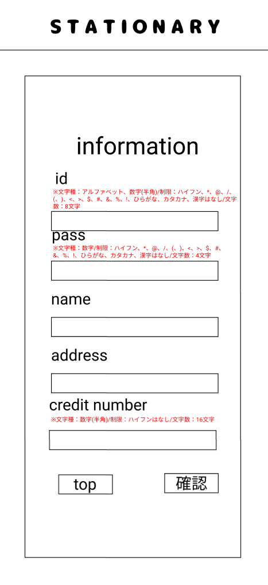

### 画面詳細図
## 会員情報
### プロトタイプは以下のリンク先
[プロトタイプ](https://www.figma.com/file/YN8g4ahM3raStzCZMDXhNA/stationary?node-id=1%3A2)
*****

*****
補足：対応DBの列はDB設計後、○を対応するテーブル・カラム名に差し替えること。

| ID | 要素 | 内容 | アクション | イベント | 対応DB |
|----|------|-----|------------|---------|-------|
|1   |バナー　　　　　        |テキスト画像ボタン|クリック   |シャーペン(ジャンル)へ遷移|-|
|2   |information　　       |テキスト　　　　　|-    　　　|-        　　　   |-|
|3   |id　　　　　　　       |テキスト　　　　　|-    　　　|-        　　　   |-|
|4   |idテキスト　　　       |入力欄　文字種:アルファベット、数字 typeをtextにする ※ハイフン、アスタリスク、アットマーク、スラッシュ、(、)、<、>、＄、＃、＆、！はなし、アルファベットと数字の組み合わせ(8文字固定)|テキスト入力|-        　　　   |○|
|5   |pass　　　　　　       |テキスト　　　　　|-    　　　|-        　　　   |-|
|6   |passテキスト　　       |入力欄　文字種:数字 typeをpasswordにする ※ハイフン、アスタリスク、アットマーク、スラッシュ、(、)、<、>、＄、＃、＆、！はなし (4文字固定)|テキスト入力|-        　　    |○|
|7   |name     　　　       |テキスト　　　　　|-    　　　|-        　　　   |-|
|8   |nameテキスト　　       |入力欄　文字種:全角/半角 ※typeをtextにする|テキスト入力|-        　　　  |○|
|9   |address　　　　        |テキスト　　　　　|-    　　　|-        　　　   |-|
|10  |addressテキスト       |入力欄　文字種:全角/半角 ※typeをtextにする|テキスト入力|-        　　　   |○|
|11  |credit number　      |テキスト　　　　　|-    　　　|-        　　　   |-|
|12  |credit numberテキスト|入力欄　文字種:数字 typeをnumberにする ※ハイフンはなし (16文字固定)|テキスト入力|-        　　　   |○|
|13  |更新ボタン　　　      |ボタン　※制限に反した入力があれば更新完了へ遷移しない|クリック　　|更新完了へ遷移　　|○|
|13  |トップボタン　　　     |ボタン　　　　　　|クリック　　|シャーペン(ジャンル)へ遷移　　|-|

