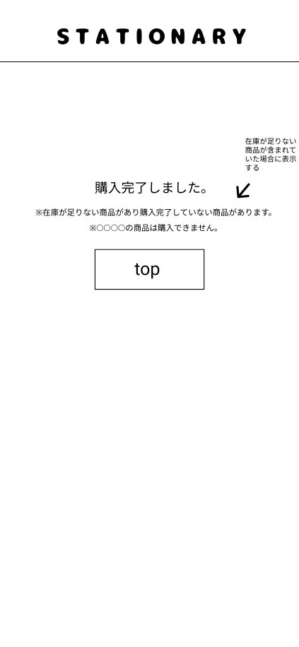

### 画面詳細図
## 購入完了
### プロトタイプは以下のリンク先
[プロトタイプ](https://www.figma.com/file/YN8g4ahM3raStzCZMDXhNA/stationary?node-id=1%3A2)
*****

*****
補足：対応DBの列はDB設計後、○を対応するテーブル・カラム名に差し替えること。

| ID | 要素 | 内容 | アクション | イベント | 対応DB |
|----|------|-----|------------|---------|-------|
|1   |バナー　　|テキスト画像|-      |-        　　　　　 　　　|-|
|2   |購入完了　|テキスト ※1つも購入できなかった場合表示しない。　　|-    　|-        　　　　　　　　 |-|
|3   |購入失敗時メッセージ|テキスト 購入できなかった商品名、購入失敗のメッセージを表示する|-| |-                       |-|
|4   |topボタン|ボタン　　　|クリック|シャーペン(ジャンル)へ遷移|-|

