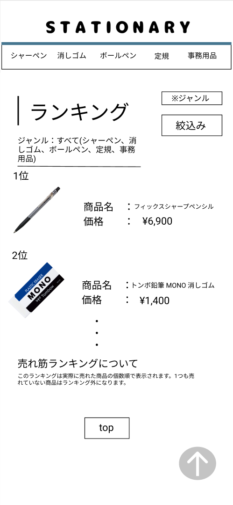

### 画面詳細図
## ランキング
### プロトタイプは以下のリンク先
[プロトタイプ](https://www.figma.com/file/YN8g4ahM3raStzCZMDXhNA/stationary?node-id=1%3A2)
*****

*****
補足：対応DBの列はDB設計後、○を対応するテーブル・カラム名に差し替えること。

| ID | 要素 | 内容 | アクション | イベント | 対応DB |
|----|------|-----|------------|---------|-------|
|1   |バナー　　　　　　       |テキスト画像ボタン|クリック|シャーペン(ジャンル)へ遷移|-|
|2   |シャーペンテキストボタン　|ボタン　　　　　　|クリック|シャーペン(ジャンル)へ遷移|-|
|3   |消しゴムテキストボタン   |ボタン　　　　　　|クリック|消しゴム(ジャンル)へ遷移|-|
|4   |ボールペンテキストボタン |ボタン　　　　　　|クリック|ボールペン(ジャンル)へ遷移|-|
|5   |定規テキストボタン       |ボタン　　　　　　|クリック|定規(ジャンル)へ遷移|-|
|6   |事務用品テキストボタン   |ボタン　　　　　　|クリック|事務用品(ジャンル)へ遷移|-|
|7   |ランキング　　　　       |テキスト　　　　　|-    　|-        　　　　　　　　|-|
|8   |ジャンル名テキスト　     |テキスト ※セレクトボックスで表示|-|-            |-|
|9   |絞込みボタン       　　　|ボタン　　　　　　|クリック|絞り込まれたランキングページへ遷移|○|
|10  |ジャンルテキスト　　     |テキスト ※始めは「すべて」と表示される ジャンルが絞られたら、絞られたジャンル名が表示され、商品も絞られる(ジャンル名：シャーペン、消しゴム、ボールペン、定規、事務用品)|-|-|-|
|11  |商品画像　　　　　       |画像 ※1列に並べられて、1画面に表示する|-    　|-        　　　　　　　　|○|
|12  |商品名　　　　　　       |テキスト　　　　　|-    　|-        　　　　　　　　|-|
|13  |商品名テキスト　　       |テキスト　　　　　|-    　|-      　　　　　　　　　|○|
|14  |価格　　　　　　　       |テキスト　　　　　|-    　|-      　　　　　　　　　|-|
|15  |価格テキスト　　　       |テキスト ※¥マークと3桁のカンマ表示|-|-　　　　　　|○|
|16  |ランキングテキスト       |テキスト ※順位を表示(1位、2位など)|-  |-      　　　　　　　　　|-|
|17  |トップページボタン       |ボタン　　　　　　|クリック|シャーペン(ジャンル)へ遷移|-|

