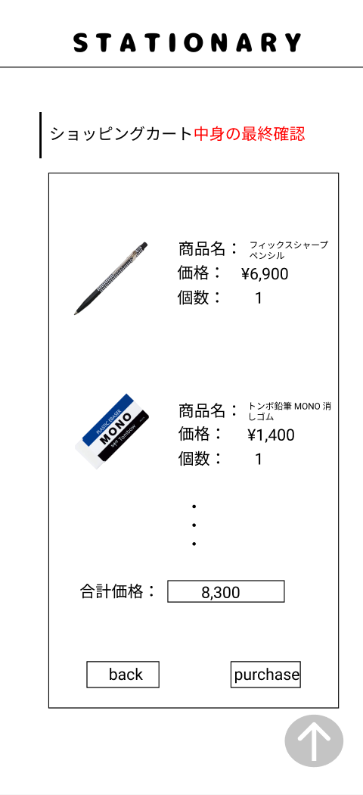

### 画面詳細図
## カートの中身最終確認
### プロトタイプは以下のリンク先
[プロトタイプ](https://www.figma.com/file/YN8g4ahM3raStzCZMDXhNA/stationary?node-id=1%3A2)
*****

*****
補足：対応DBの列はDB設計後、○を対応するテーブル・カラム名に差し替えること。

| ID | 要素 | 内容 | アクション | イベント | 対応DB |
|----|------|-----|------------|---------|-------|
|1   |バナー　　　　　　|テキスト画像ボタン|クリック|シャーペン(ジャンル)へ遷移|-|
|2   |ショッピングカート|テキスト　　　　　|-    　|-        　　　　　　　　|-|
|3   |商品画像　　　　　|画像 ※1列に並べられて、1画面に表示する|-    　|-  |○|
|4   |商品名　　　　　　|テキスト　　　　　|-    　|-        　　　　　　　　|-|
|5   |商品名テキスト　　|テキスト　　　　　|-    　|-      　　　　　　　　　|○|
|6   |価格　　　　　　　|テキスト　　　　　|-    　|-      　　　　　　　　　|-|
|7   |価格テキスト　　　|テキスト　※¥マークと3桁のカンマを表示|-|- 　　　　|○|
|8   |合計価格　　　　　|テキスト　　　　　|-    　|-      　　　　　　　　　|-|
|9   |合計価格テキスト　|テキスト ※3桁のカンマを表示|-|- 　　　　　　　　　|-|
|10  |個数　　　　　    |テキスト　　　　　|-    　|-      　　　　　　　　　|-|
|11  |個数テキスト　    |テキスト ※3桁のカンマを表示|-    　|-      　　　　|○|
|12  |購入確定ボタン　　|ボタン　　　　　　|クリック|購入完了へ遷移　　　　　　|○|
|14  |戻るボタン　　　　 |ボタン　　　　　　|クリック|シャーペン(ジャンル)へ遷移|○|
|15  |矢印ボタン　　　　　|ボタン　※4品目から表示|クリック　　|ページ上部へ自動スクロール　　　　|-|
