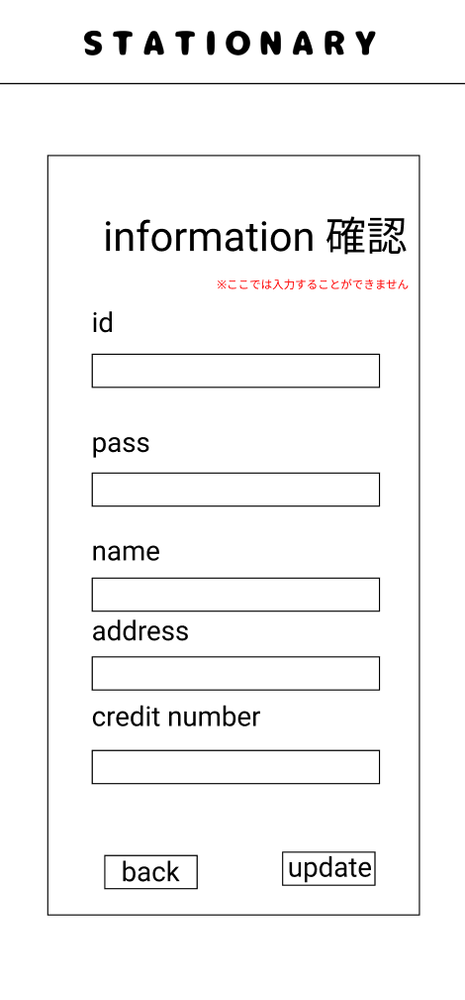

### 画面詳細図
## 会員情報確認
### プロトタイプは以下のリンク先
[プロトタイプ](https://www.figma.com/file/YN8g4ahM3raStzCZMDXhNA/stationary?node-id=1%3A10)
*****

*****
補足：対応DBの列はDB設計後、○を対応するテーブル・カラム名に差し替えること。

| ID | 要素 | 内容 | アクション | イベント | 対応DB |
|----|------|-----|------------|---------|-------|
|1   |バナー　　　　        |テキスト画像ボタン|クリック　　|シャーペン(ジャンル)へ遷移|-|
|2   |information　        |テキスト　　　　　|-    　　　|-        |-|
|3   |id　　　　　　        |テキスト　　　　　|-    　　　|-        |-|
|4   |idテキスト　　        |テキスト　文字種:アルファベット、数字(半角) ※typeをtextにする ハイフン、アスタリスク、アットマーク、スラッシュ、(、)、<、>、＄、＃、＆、！、％、ひらがな、漢字はなし、アルファベットと数字の組み合わせ(8文字固定)|-|-       |○|
|5   |pass　　　　　        |テキスト　　　　　|-    　　　|-        |-|
|6   |passテキスト　       |テキスト　文字種:数字(半角) ※typeをpasswordにする ハイフン、アスタリスク、アットマーク、スラッシュ、(、)、<、>、＄、＃、＆、！、％、アルファベット、ひらがな、漢字はなし (4文字固定)|-|-       |○|
|7   |name     　　        |テキスト　　　　　|-　　　    |-        |-|
|8   |nameテキスト　       |テキスト　文字種:全角/半角 ※typeをtextにする|-|-       |○|
|9   |address　　　        |テキスト　　　　　|-　　　    |-        |-|
|10  |addressテキスト      |テキスト　文字種:全角/半角 ※typeをtextにする|-|-        |○|
|11  |credit number       |テキスト　　　　　|-　　　    |-        |-|
|12  |credit numberテキスト|テキスト　文字種:数字(半角) ※typeをnumberにする ハイフンはなし (16文字固定)|-|-        |○|
|13  |会員情報更新ボタン　  |ボタン　　　　　　|クリック　　|更新成功/更新失敗へ遷移|○|
|14  |戻るボタン　         |ボタン　　　　　　|クリック　　|会員情報へ遷移|-|
|15  |注意事項テキスト　　　|テキスト　　　　  |-  　　    |-            |-|

