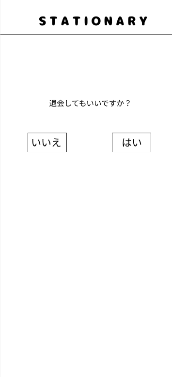

### 画面詳細図
## 退会確認
### プロトタイプは以下のリンク先
[プロトタイプ](https://www.figma.com/file/YN8g4ahM3raStzCZMDXhNA/stationary?node-id=1%3A2)
*****

*****
補足：対応DBの列はDB設計後、○を対応するテーブル・カラム名に差し替えること。

| ID | 要素 | 内容 | アクション | イベント | 対応DB |
|----|------|-----|------------|---------|-------|
|1   |バナー　　　　　　|テキスト画像|-      |-                  |-      |
|2   |退会確認テキスト　　　　|テキスト　　|-   　 |-                 |-      |
|3   |いいえボタン|ボタン　　|クリック|会員情報へ遷移|-      |
|3   |はいボタン|ボタン　　　|クリック|退会へ遷移|-      |

