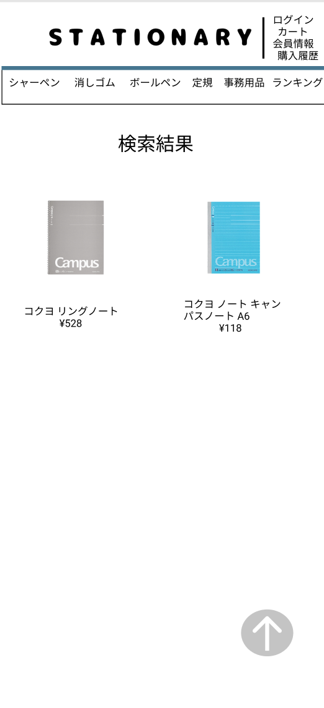

### 画面詳細図
## 検索結果
### プロトタイプは以下のリンク先
[プロトタイプ](https://www.figma.com/file/YN8g4ahM3raStzCZMDXhNA/stationary?node-id=1%3A)
*****

*****
補足：対応DBの列はDB設計後、○を対応するテーブル・カラム名に差し替えること。

| ID | 要素 | 内容 | アクション | イベント | 対応DB |
|----|------|-----|------------|---------|-------|
|1   |バナー　　　　|テキスト画像     |-          |-                  |-|
|2   |ログアウトボタン|ボタン         |クリック　　|ログアウトへ遷移    |○|
|3   |カートボタン　|ボタン　　　　　　|クリック　　|カートへ遷移|○|
|4   |会員情報ボタン|ボタン　　　　　　|クリック　　|会員情報へ遷移|○|
|5   |履歴ボタン　　|ボタン　　　　　　|クリック　　|履歴へ遷移|-|
|6   |ジャンルボタン|ボタン　　　　　　|クリック　　|そのジャンルのページへ遷移|-|
|7   |検索結果　　　|テキスト　　　　　|-          |-                        |-|
|8   |商品画像ボタン|商品画像ボタン 2列で当てはまる商品を1画面に表示する|クリック|商品詳細へ遷移|○|
|9   |商品名/値段　|テキストボタン ¥マークと3桁のカンマをつけて表示する|クリック　　|商品詳細へ遷移|○|

