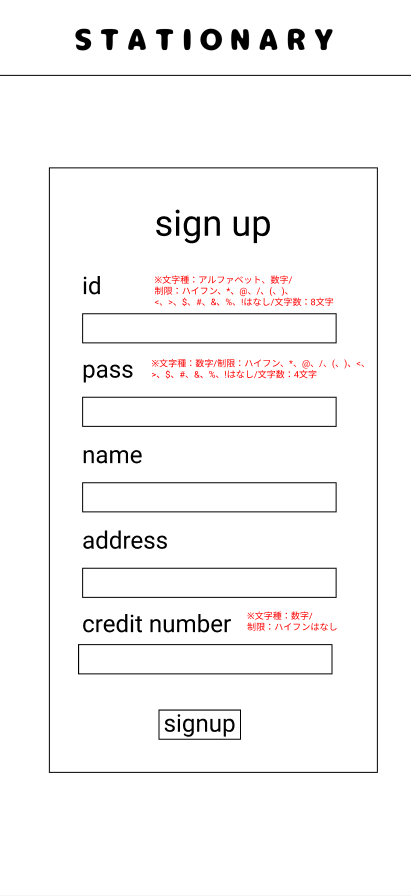

### 画面詳細図
## 新規登録
### プロトタイプは以下のリンク先
[プロトタイプ](https://www.figma.com/file/YN8g4ahM3raStzCZMDXhNA/stationary?node-id=1%3A10)
*****

*****
補足：対応DBの列はDB設計後、○を対応するテーブル・カラム名に差し替えること。

| ID | 要素 | 内容 | アクション | イベント | 対応DB |
|----|------|-----|------------|---------|-------|
|1   |バナー　　　　        |テキスト画像ボタン|クリック　　|シャーペン(ジャンル)へ遷移|-|
|2   |sign up　　　        |テキスト　　　　　|-    　　　|-        |-|
|3   |id　　　　　　        |テキスト　　　　　|-    　　　|-        |-|
|4   |idテキスト　　        |入力欄　文字種:数字 typeをnumberにする ハイフンはなし|テキスト入力|-       |○|
|5   |pass　　　　　        |テキスト　　　　　|-    　　　|-        |-|
|6   |passテキスト　       |入力欄　文字種:アルファベット/数字 typeをpasswordにする|テキスト入力|-       |○|
|7   |name     　　        |テキスト　　　　　|-　　　    |-        |-|
|8   |nameテキスト　       |入力欄　文字種:かな文字/アルファベット/数字 typeをtextにする|テキスト入力|-       |○|
|9   |address　　　        |テキスト　　　　　|-　　　    |-        |-|
|10  |addressテキスト      |入力欄　文字種:かな文字/アルファベット/数字 typeをtextにする|テキスト入力|-        |○|
|11  |credit number       |テキスト　　　　　|-　　　    |-        |-|
|12  |credit numberテキスト|入力欄　文字種:数字 typeをnumberにする ハイフンはなし|テキスト入力|-        |○|
|13  |新規登録ボタン　      |ボタン　　　　　|クリック　　|新規登録処理実行|○|

