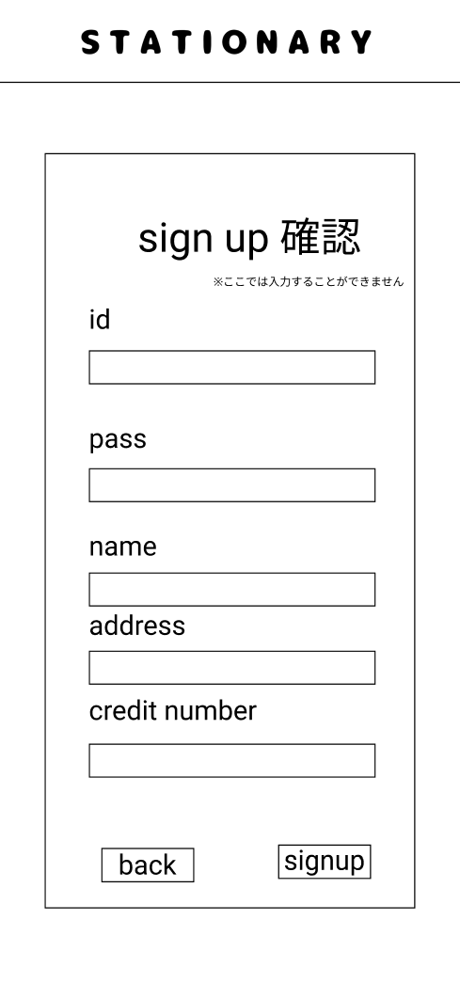

### 画面詳細図
## 新規登録確認
### プロトタイプは以下のリンク先
[プロトタイプ](https://www.figma.com/file/YN8g4ahM3raStzCZMDXhNA/stationary?node-id=1%3A10)
*****

*****
補足：対応DBの列はDB設計後、○を対応するテーブル・カラム名に差し替えること。

| ID | 要素 | 内容 | アクション | イベント | 対応DB |
|----|------|-----|------------|---------|-------|
|1   |バナー　　　　        |テキスト画像ボタン|クリック　　|ログインへ遷移|-|
|2   |sign up　　　        |テキスト　　　　　|-    　　　|-        |-|
|3   |id　　　　　　        |テキスト　　　　　|-    　　　|-        |-|
|4   |idテキスト　　        |テキスト　文字種:アルファベット、数字 ※typeをtextにする ハイフン、アスタリスク、アットマーク、スラッシュ、(、)、<、>、＄、＃、＆、！、％、ひらがな、漢字はなし、アルファベットと数字の組み合わせ(8文字固定)|テキスト入力|-       |○|
|5   |pass　　　　　        |テキスト　　　　　|-    　　　|-        |-|
|6   |passテキスト　       |テキスト　文字種:数字 ※typeをpasswordにする ハイフン、アスタリスク、アットマーク、スラッシュ、(、)、<、>、＄、＃、＆、！、％、アルファベット、ひらがな、漢字はなし (4文字固定)|テキスト入力|-       |○|
|7   |name     　　        |テキスト　　　　　|-　　　    |-        |-|
|8   |nameテキスト　       |テキスト　文字種:全角/半角 ※typeをtextにする 新規登録確認から戻ってきた場合に表示させる|テキスト入力|-       |○|
|9   |address　　　        |テキスト　　　　　|-　　　    |-        |-|
|10  |addressテキスト      |テキスト　文字種:全角/半角 ※typeをtextにする 新規登録確認から戻ってきた場合に表示させる|テキスト入力|-        |○|
|11  |credit number       |テキスト　　　　　|-　　　    |-        |-|
|12  |credit numberテキスト|テキスト　文字種:数字 ※typeをnumberにする ハイフンはなし (16文字固定)|テキスト入力|-        |○|
|13  |新規登録ボタン　      |ボタン ※制限に反した入力があれば次の画面へ遷移しない|クリック　　|登録成功/登録失敗へ遷移|○|
|14  |戻るボタン　         |ボタン　　　　　　|クリック　　|新規登録へ遷移|-|

