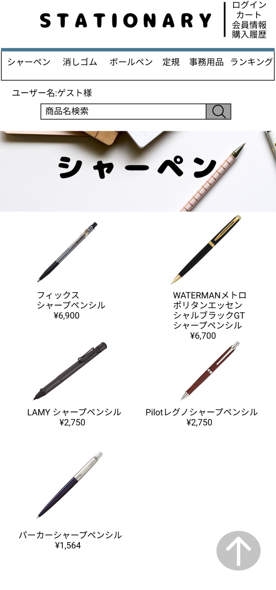

### 画面詳細図
## トップページ(シャーペン[ジャンル])
### プロトタイプは以下のリンク先
[プロトタイプ](https://www.figma.com/file/YN8g4ahM3raStzCZMDXhNA/stationary?node-id=1%3A10)
*****

*****
補足：対応DBの列はDB設計後、○を対応するテーブル・カラム名に差し替えること。

| ID | 要素 | 内容 | アクション | イベント | 対応DB |
|----|------|-----|------------|---------|-------|
|1   |バナー　　　　|テキスト画像ボタン|クリック　　|シャーペン(ジャンル)へ遷移|-|
|2   |ログイン/ログアウトボタン|ボタン |クリック　　|ログイン/ログアウトへ遷移|○|
|3   |カートボタン　|ボタン　　　　　　|クリック　　|カートへ遷移|○|
|4   |会員情報ボタン|ボタン　　　　　　|クリック　　|会員情報へ遷移|○|
|5   |ジャンルボタン|ボタン　　　　　　|クリック　　|そのジャンルのページへ遷移|-|
|6   |商品名検索　　|入力欄　　　　　　|テキスト入力|-        |-|
|7   |検索ボタン　　|ボタン　　　　　　|クリック　　|検索処理実行|○|
|8   |ジャンル名　　|テキスト画像　　　|-  　　　  |-        |-|
|9   |商品画像　　　|画像ボタン　　　　|クリック　　|商品詳細へ遷移|○|
|10  |商品名/価格　|テキストボタン　　|クリック　　|商品詳細へ遷移|○|

